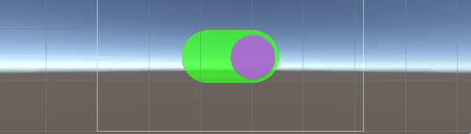
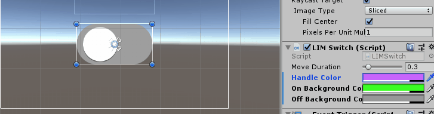
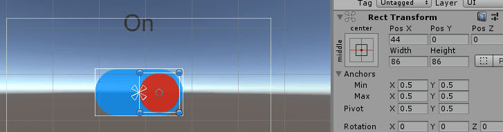

[한국어](https://github.com/dlawotjd1020/LimSwitches/blob/master/README.md)  /  [English](https://github.com/dlawotjd1020/LimSwitches/blob/master/README.en.md)

LimSwitches
===========
C# Switch using uGUI for Unity
-----------------------------
본 소스파일은 C#으로 제작되었고, Unity 에서 스위치 UI를 보다 쉽게 사용 할 수 있도록 만들어졌으며

누구나 제약 없이 어느 분야에서든 사용 하실 수 있습니다.

## 기능
1. 스위치 백그라운드의 길이에 맞춰 자동으로 스위치가 이동합니다.

2. 스위치의 핸들 색상과 , 스위치 배경의 색상을 변경 할 수 있습니다.

3. 스위치의 핸들 이동속도를 지정해줄수 있습니다 (색상의 변경 시간과 같습니다)

4. 스위치의 상태에 따라 오브젝트를 제어 할 수 있습니다.

## 사용설명서
[설명서 링크](https://blog.naver.com/lonely_2/221674536233) 입니다.

## 사용 전 주의사항

본 스위치는 샘플 이미지 이외에 다른 이미지는 제공을 하고있지 않습니다. 
다른 모양의 스위치를 원하시면 별도의 이미지를 준비 해주세요.

## 건의 및 의견
기타 건의, 질문이 있으시다면, 메일을 보내주세요.
dlawotjd1020@gmail.com
